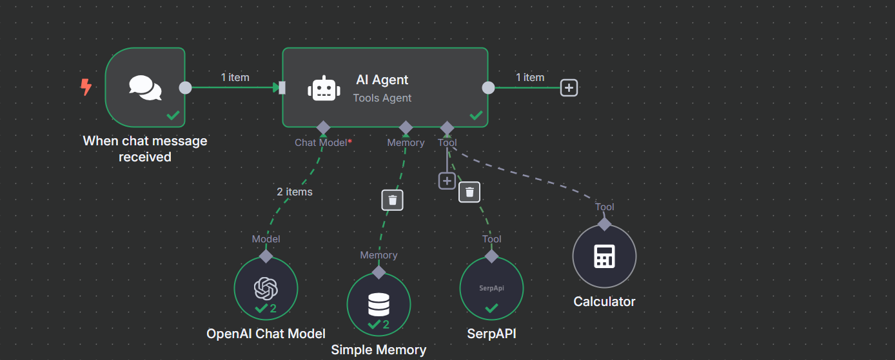

# 🤖 AI Chat Agent with n8n (Work in Progress)

This is an experimental chatbot built using [n8n](https://n8n.io/). It's designed to receive chat messages, use AI to respond, and access external tools like calculators or search APIs.

> 🚧 This project is still in development. I'm iterating regularly and documenting everything!..

---

## 🧩 Current Features

- 🧠 Uses OpenAI Chat Model(api)
- 🗂️ Maintains memory of previous chat context
- 🔎 Integrates SerpAPI for search
- ➕ Supports math via Calculator tool
- ⚡ Triggered by chat message input

---

## 🛠 What's Next (Planned Improvements)

- ✅ Better UI/UX for users
- 🔐 Secure API key handling with environment variables
- 📦 Add vector DB or long-term memory store
- 🧪 Test with real-world prompts
- 🚀 Deploy with webhook & chat frontend (Bubble/React/Nuxt)

---

## 💬 Demo

### Current Workflow

### Workflow JSON

You can find the export under [`workflows/ai-agent-workflow.json`](workflows/ai-agent-workflow.json)

---

## 📅 Roadmap

You can follow ongoing progress and ideas in [roadmap.md](roadmap.md)

---

## 🙋‍♂️ About Me

. Follow the journey, contribute ideas, or just say hi!

